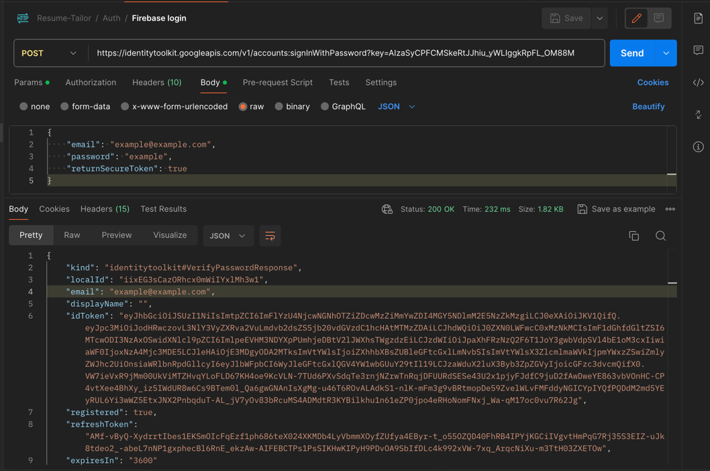
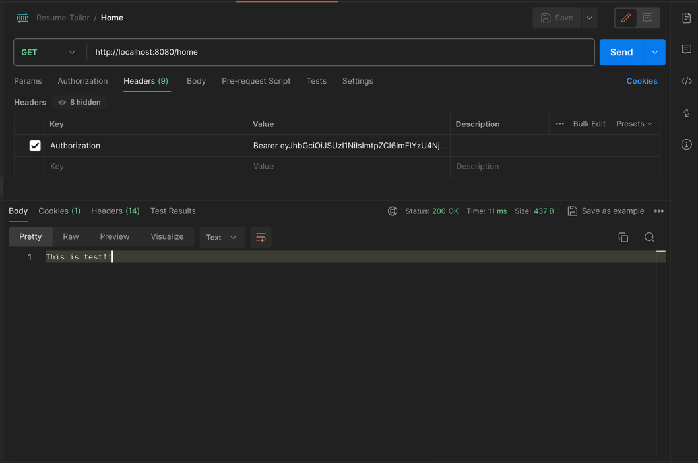

# Resume Tailor - Backend Setup

Resume Tailor is a capstone project which enables users to create a resume and cover letter based on the specific job description.

## Prerequisites

Before getting started, ensure you have the following:

- Java Development Kit (JDK) installed on your machine
- Maven installed
- Firebase account (test-app) and project (test-app) created (test-app in our case)
- Spring Boot project initialized

## Step 1: Configure Firebase Project in spring boot (Add Firebase SDK to spring boot)

1. Go to the Firebase console: [Firebase Console](https://console.firebase.google.com/)
2. Select our project named "test-app".
3. Navigate to the "Project Settings" section.
4. Go to "Service accounts" and click below "Generate new private key".
5. This will create a JSON file which is our private key to connect to test-app.
6. Rename this file to "firebase-admin-sdk.json" and place it inside "/src/main/resources" folder.

## Step 2: Configure MongoDB in Spring Boot
1. Go to the Mongo Compass console or online Mongo Atlas.
2. Create a new database named "resume_tailor". And a collection named "users" for test until now as I have done "/users" GET API.
3. Inside folder "/src/main/resources", open "application.properties" and paste the following setup.
    ```
    spring.data.mongodb.host=localhost
    spring.data.mongodb.port=27017
    spring.data.mongodb.database=resume_tailor
    spring.data.mongodb.authentication-database=admin
   ```
   
    This is our connection setup for MongoDB to our spring boot application.

You might want to reload your maven dependencies once in your application. You can see online how to reload maven dependencies based on your IDEs.

Now, Run the application. And try to test the endpoint as below:



The url in post is our login to firebase. You can use any email and password in the test-app firebase.
Copy the "idToken" and use it as token in authenticated api i.e "/home" in our case.

In "/home", click on Headers, select "Authorization", and add "Bearer [copied token]" and call the api as below.



If the token is not valid, it will give error as 401 unauthorized.

